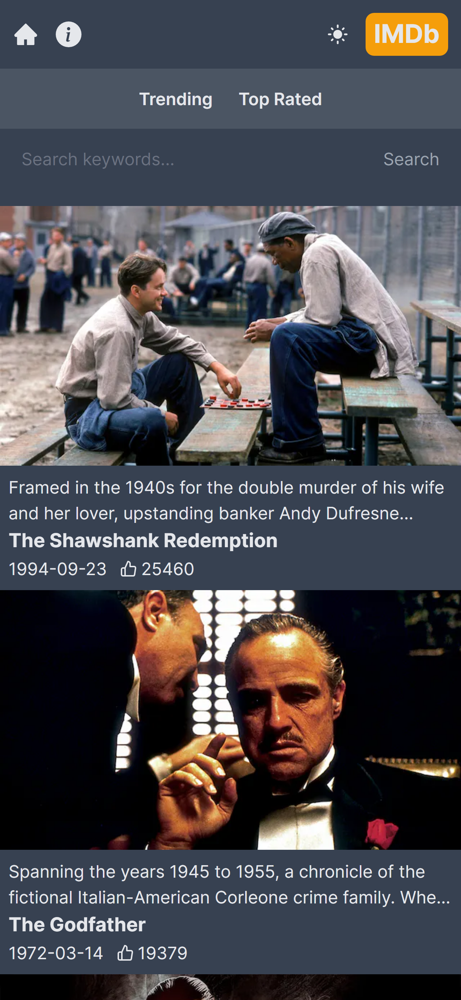
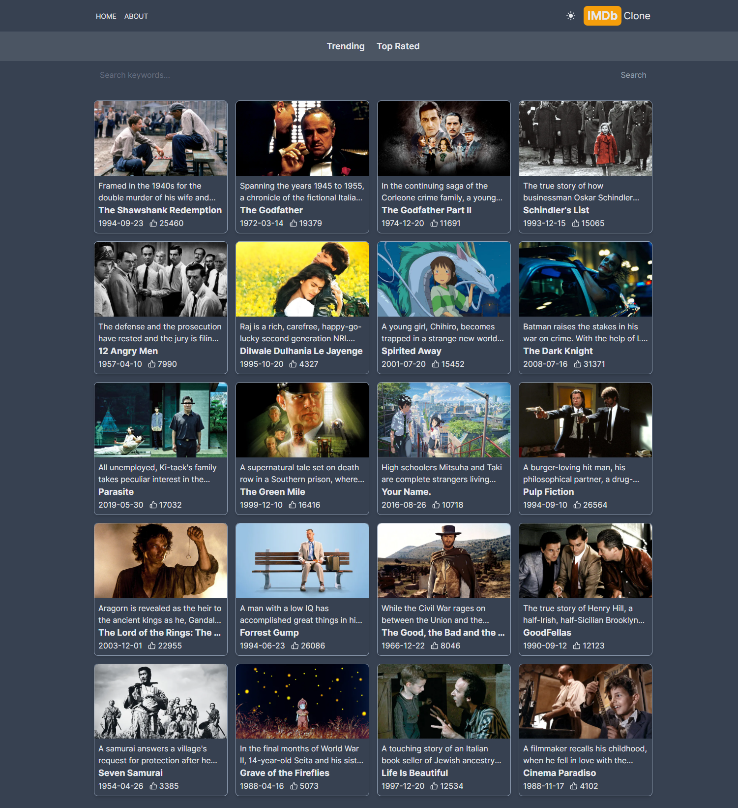

# IMDb Clone with NextJs

This project is a simple IMDb clone, built with NextJs and TMDB API.

## Table of contents

- [Overview](#overview)
  - [The project](#the-project)
  - [Screenshot](#screenshot)
  - [Links](#links)
- [My process](#my-process)
  - [Built with](#built-with)
  - [What I learned](#what-i-learned)
  - [Useful resources](#useful-resources)

## Overview

### The project

App features:

- Search movies
- See movie details with nextjs dynamic pagination
- See a loading spinner when fetching the data
- See a try again button when fetching error

### Screenshot

#### Mobile Preview

#### Desktop preview

### Links

- [Github repo](https://github.com/nurmarief/imdb-clone-nextjs/)
- [Live site](https://imdb-clone-nextjs-vert.vercel.app/)

## My process

### Built with

- NextJs 14
- Tailwindcss

### What I Learned

- NextJs pagination
- NextJs directives: 'use client'
- NextJs components: Image, Link
- NextJs useful 3rd party package: next-themes

### Useful resources

- [loading.io](https://loading.io/)
